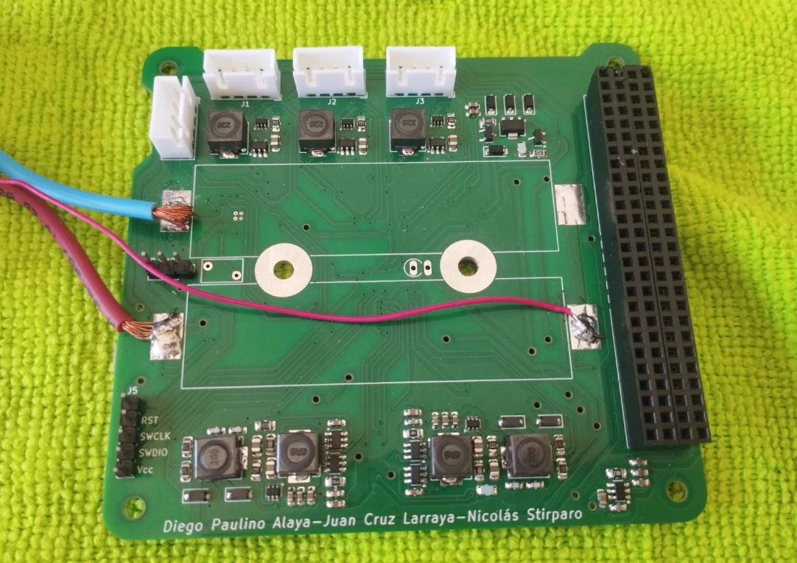
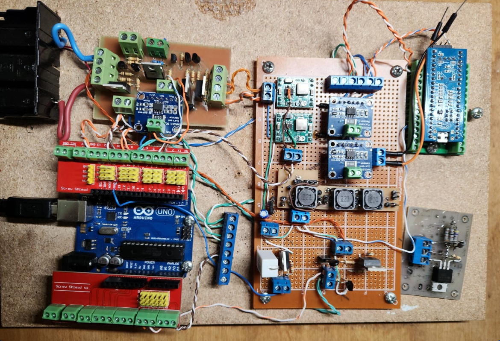
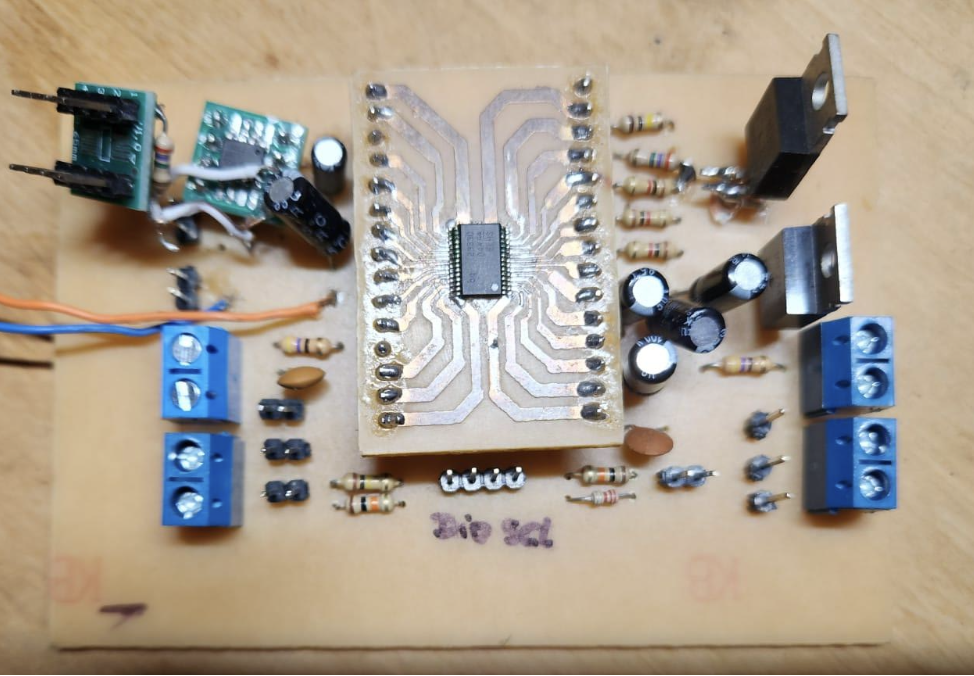
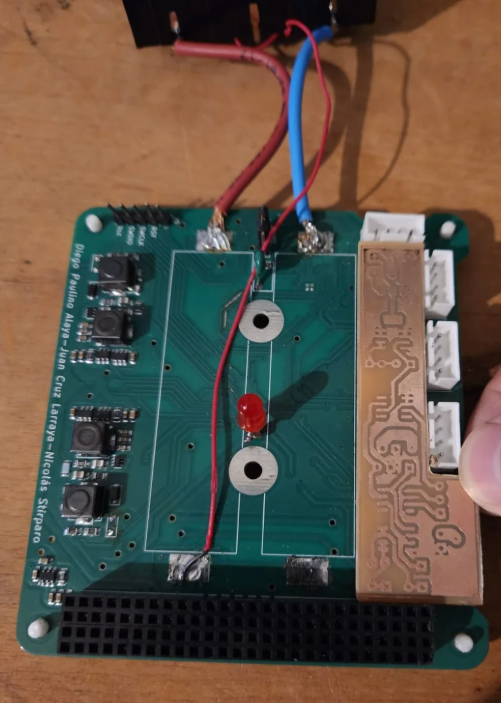

# EPS CubeSat - Sistema de Gestión de Energía

Sistema de gestión de energía (EPS - Electric Power System) para CubeSat, diseñado para cumplir con las especificaciones requeridas en tensiones de salida, tasas de datos para comunicación con periféricos y vida útil extendida.

## Autores

- **Larraya, Juan Cruz** - 104162 - jlarraya@fi.uba.ar
- **Stirparo, Nicolás** - 105885 - nstirparo@fi.uba.ar
- **Paulino Alaya, Diego** - 104311 - dpaulino@fi.uba.ar

## Director y Codirectores

- **Director**: Enrique Jorge Castelli
- **Codirectores**:
  - Fernando Filippetti
  - Monica Viviana Nitoli

## Introducción

El EPS es uno de los subsistemas más críticos de un satélite, ya que de su correcto funcionamiento depende la operación continua de los demás módulos, tales como el sistema de comunicaciones, el control de actitud y el payload. Su rol principal es gestionar la energía captada por los paneles solares, regular y distribuir las tensiones necesarias, cargar las baterías y garantizar tanto la protección de las mismas como la seguridad de los circuitos asociados. Además, debe ser capaz de sensar parámetros eléctricos y térmicos para reportarlos al computador a bordo y así optimizar la eficiencia energética durante la misión.

## Motivación

Este proyecto surge de la escasa oferta de módulos EPS en Sudamérica y de los elevados costos de los productos disponibles en el mercado internacional, que en muchos casos carecen de documentación abierta para su integración. Ante esta situación, se plantea la oportunidad de desarrollar un sistema propio que no solo satisfaga las necesidades técnicas del CubeSat propuesto, sino que también contribuya al crecimiento de la industria espacial argentina mediante la generación de conocimiento y tecnología local.

## Objetivos

El proyecto entrega un **prototipo operativo** junto con:
- Documentación técnica completa
- Mediciones necesarias para su validación
- Circuito esquemático para realizar copias del circuito industrialmente a escala en un PCB bajo la norma PC104

## Características Técnicas

El sistema EPS desarrollado cuenta con las siguientes características:

### Diseño Modular
- **PPC (Power Processing and Control)**: Optimizado con control digital directo
- **BMS (Battery Management System)**: Sistema de gestión de baterías a medida
- **PDU (Power Distribution Unit)**: Unidad de distribución de energía eficiente

### Monitoreo y Sensado
- Bus I²C con sensores **INA219** para monitoreo preciso y escalable
- Medición de tensión, corriente y temperatura en puntos críticos del sistema
- Telemetría completa de parámetros eléctricos y térmicos

### Gestión Inteligente de Baterías (BMS)
- Protección integral contra sobre y baja tensión
- Protección contra sobrecorriente
- Monitoreo de temperatura
- Estado de carga (SOC)
- Capacidad de balanceo de celdas

### Cargador de Baterías con MPPT
- Extracción de máxima potencia de los paneles solares
- Algoritmo MPPT para optimización de eficiencia de carga
- Tres canales de entrada fotovoltaica independientes

### Regulación y Distribución de Energía
- Tres buses de alimentación regulados (3.3V, 5V)
- Redundancia en las salidas de 3.3V y 5V
- Limitadores de corriente en cada canal
- Compatibilidad con norma PC104

### Interfaz de Comunicación
- Comunicación UART/USART con la computadora a bordo del CubeSat
- Comandos y lectura de registros de estado de todos los módulos
- Bus I²C para sensores y periféricos

## Desarrollo del Proyecto

### Prototipo Final

<p align="center">
  
</p>

<p align="center">
  
</p>

### Fallos Encontrados y Soluciones Implementadas

Durante el desarrollo del proyecto se enfrentaron desafíos significativos que requirieron cambios en la metodología y arquitectura del sistema:

#### 1. Fallo Funcional del Primer Prototipo Monolítico

**Problema:** El diseño inicial, concebido como una solución "todo en uno" y fabricado profesionalmente, falló en las pruebas iniciales. Esto se debió a la complejidad inherente de un sistema monolítico, donde la interdependencia de los componentes dificulta la depuración y la identificación de la causa raíz de los fallos.

<p align="center">
  
</p>

**Solución:** Se adoptó una metodología de desarrollo modular e incremental. El sistema EPS se descompuso en sus bloques funcionales principales (PPC, BMS, PDU), y cada módulo se implementó y probó de forma aislada utilizando prototipos de bajo costo. Esta estrategia permitió una depuración más controlada y económica.

#### 2. Ineficiencia en la Adquisición de Datos (Mapeo Directo por ADC)

**Problema:** El enfoque preliminar utilizaba divisores de tensión y amplificadores operacionales conectados directamente a las entradas ADC del microcontrolador. Esto resultaba en un alto consumo de pines, complejidad del circuito debido a la circuitería de acondicionamiento de señal para cada medición, y susceptibilidad al ruido en las largas pistas analógicas.

<p align="center">
  
</p>

**Solución:** Se migró a una arquitectura de monitoreo digital y distribuida basada en el bus I²C, utilizando sensores de corriente y potencia INA219. Estos dispositivos integran un amplificador de precisión y un ADC de 12 bits, transmitiendo mediciones de forma digital. Esta solución redujo drásticamente el uso de pines del microcontrolador, simplificó la interconexión, aumentó la precisión y la robustez frente al ruido.

## Estructura del Repositorio

```
TPP/
├── firmware/                      # Código fuente del firmware
│   ├── TPP STM/                  # Firmware principal para STM32
│   └── demos/                    # Demostraciones y pruebas
│       ├── DuinoSTM32/          # Ejemplos con Arduino IDE para STM32
│       ├── STM32CubeIDE/        # Proyectos de STM32CubeIDE
│       ├── filmwareSTM32/       # Firmware de prueba STM32
│       └── pruebasMppt/         # Pruebas del algoritmo MPPT
│           ├── arduino/         # Versión Arduino
│           ├── esp32/           # Versión ESP32
│           └── bluePIlPrueba/   # Versión Blue Pill (STM32F103)
│
├── hardware/                      # Diseños de hardware
│   ├── PowerSis-V0.0/           # Versión inicial del diseño
│   └── kikads/                   # Diseños en KiCad
│       ├── PowerSis-V4.4+modFinales/  # Versión 4.4 con modificaciones finales
│       ├── PowerSis-V5.0/            # Versión 5.0 (última versión)
│       └── superados/                # Versiones anteriores superadas
│
├── utilidades/                    # Herramientas y scripts de utilidad
│
├── Info util CubeSat ENERGIA/    # Información y documentación de referencia
│
└── TPP Informe.pdf               # Informe técnico del proyecto
```

## ¿Qué puedes hacer con este proyecto?

### 1. Explorar el Diseño de Hardware
Navega a la carpeta `hardware/kikads/PowerSis-V5.0/` para encontrar:
- Esquemáticos del circuito completo
- Layout del PCB en formato PC104
- Lista de materiales (BOM)
- Archivos de fabricación (Gerbers)

### 2. Compilar y Cargar el Firmware
El firmware principal se encuentra en `firmware/TPP STM/`:
- Compatible con STM32
- Incluye implementación de BMS, MPPT y PDU
- Comunicación I²C y UART
- Drivers para sensores INA219

### 3. Probar Módulos Individuales
Utiliza los demos en `firmware/demos/` para:
- Probar el algoritmo MPPT de forma aislada
- Verificar la comunicación con el BQ (BMS IC)
- Testear PWM y control de conversores
- Desarrollar sobre diferentes plataformas (Arduino, ESP32, STM32)

### 4. Replicar el Sistema
Con la documentación incluida puedes:
- Fabricar tu propio PCB siguiendo el diseño PC104
- Ensamblar el sistema con la lista de materiales
- Cargar el firmware en un microcontrolador STM32
- Integrar el EPS en tu propio CubeSat

### 5. Modificar y Adaptar
El proyecto es completamente abierto para:
- Adaptar las tensiones de salida a tus necesidades
- Modificar los algoritmos de control
- Agregar nuevos sensores o funcionalidades
- Optimizar para diferentes perfiles de misión

## Documentación

- **Informe Técnico Completo**: `TPP Informe.pdf`
- **Información de Referencia**: Carpeta `Info util CubeSat ENERGIA/`
- **Esquemáticos**: `hardware/kikads/PowerSis-V5.0/`

## Requisitos

### Para el Hardware
- PCB fabricado según diseño PC104
- Componentes según BOM incluida
- Paneles solares compatibles
- Baterías LiPo/Li-Ion

### Para el Firmware
- STM32 (recomendado STM32F103 o superior)
- IDE: Arduino IDE con soporte STM32 o STM32CubeIDE
- Programador ST-Link V2 o compatible
- Sensores INA219 para telemetría

## Primeros Pasos

1. **Revisar la documentación**: Lee el informe técnico (`TPP Informe.pdf`)
2. **Explorar el hardware**: Abre los esquemáticos en KiCad desde `hardware/kikads/PowerSis-V5.0/`
3. **Compilar un demo**: Prueba el código MPPT desde `firmware/demos/pruebasMppt/`
4. **Cargar el firmware principal**: Desde `firmware/TPP STM/`

## Licencia

Este proyecto se desarrolla como Trabajo Práctico Profesional de la Facultad de Ingeniería - UBA, con el objetivo de contribuir al desarrollo de la tecnología espacial argentina.

## Contacto

Para consultas sobre el proyecto, contactar a los autores a través de sus correos electrónicos listados arriba.

---

**Universidad de Buenos Aires - Facultad de Ingeniería**
*Trabajo Práctico Profesional - 2024*
